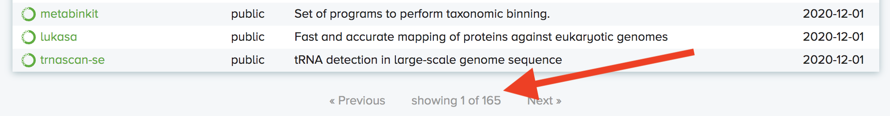

# bioConda Package Repository Search Engine
A tutorial on how to produce your own bioConda package repository search engine

## Purpose
Currently there is not an efficient method to search <a href="https://anaconda.org/bioconda/repo">bioConda repositories</a> if you are not already familiar with the names of the programs you are looking for. For example, you would easily find the "STAR" alignment package individually; however, may have more difficulty finding all programs availiable in BioConda related to alignment. 

## Required Software
In order to run the Python Script you will need an up-to-date version of Python 3. The code was specifically written in Python 3.7.6. A recommended way to access Python is via the Spyder Console availiable from <a href="https://www.anaconda.com/">anaconda.com</a>. Furthermore you will need <a href="https://brew.sh/"> HomeBrew</a> in order to install both <a href="https://docs.datasette.io/en/stable/installation.html">datasette</a> and <a href="https://devcenter.heroku.com/articles/heroku-cli#download-and-install">heroku</a>. 

## Required Accounts
You can sign up for a free Heroku account for hosting at <a href="https://www.heroku.com/">heroku.com</a>. The account will come with 550 free dyno hours per month which can cover approx. 70-80% of the month for continous usage. 

## Instructions
Download the python script and open it from your working directory. This is the folder where you want the database file to be saved. 

Find the current number of conda pages and place this value within the first parameter of the extractBioCondaData() function call within the main function (line 67). This will ensure that all the packages are pulled down from the conda repository. 

Run the program and ensure that the database is generated. 

Open Terminal. If necessary install homebrew, datasette and heroku CLI (command line interface). 

Log into your Heroku account with the "heroku login" command.

Utilize the "datasette publish heroku mydatabase.db" command (replacing mydatabase.db with your database name) in order to publish the dataset to the cloud. Include the "-n my-app-name" flag on the end of the command in order to give your project a custom name. Once this has finished running you will be provided with a link where your database search applet is availiable. 

## Datasette Applet

See this page for example Datasette Applets: <a href="https://github.com/simonw/datasette/wiki/Datasettes">examples</a>

The interface includes many different data outputs and custom SQL search features. The easiest way to search summaries is shown in the following screenshot (should be located two clicks into the table).

